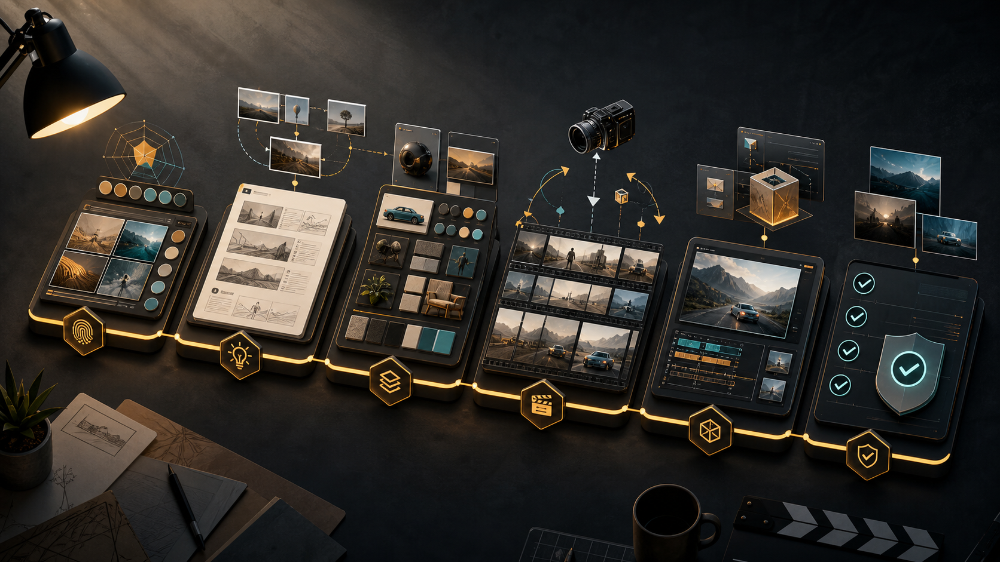
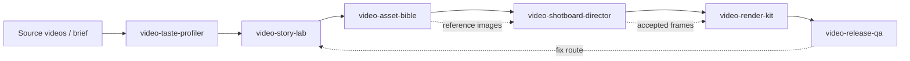
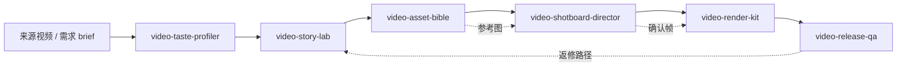

<div align="center">
  
  <h1>Video Studio Skills</h1>
  <p><strong>A modular agent skill pack for AI video development, from taste research to release QA.</strong></p>
  <p>
    <a href="#english"><strong>English</strong></a>
    ·
    <a href="#中文"><strong>中文</strong></a>
  </p>
  <p>
    <code>6 production skills</code>
    <code>AI video workflow</code>
    <code>Codex-ready</code>
    <code>No secrets required</code>
  </p>
</div>

---

## English

Video Studio Skills is a practical skill pack for making AI-generated videos with a repeatable production workflow. It helps an agent move from source research and taste extraction to story planning, visual continuity, timed shotboards, provider-ready render prompts, and final release QA.

<table>
  <tr>
    <td width="33%"><strong>Research</strong><br>Turn videos, creators, or references into reusable taste profiles without cloning identity or copying shots.</td>
    <td width="33%"><strong>Production</strong><br>Build scripts, asset bibles, shotboards, and render packages that keep scenes coherent across generations.</td>
    <td width="33%"><strong>Release</strong><br>Check continuity, platform fit, cover/key art, titles, captions, and final delivery risks.</td>
  </tr>
</table>

### Skill Stack

| Skill | Use it for | Durable outputs |
| --- | --- | --- |
| `video-taste-profiler` | Analyze a creator, account, public video set, local video, or reference set into reusable video taste. | `taste/<slug>/manifest.json`, `taste.md`, `source-log.md`, `prompt-vocabulary.md` |
| `video-story-lab` | Generate original concepts, scripts, scene plans, narration, and platform-native story structures. | `plans/<project>-concepts.md`, `script.md`, `scene-plan.md` |
| `video-asset-bible` | Define recurring characters, locations, props, wardrobe, materials, continuity anchors, and reference image prompts. | `assets-bible/`, `characters/`, `locations/`, `props/`, `continuity-rules.md` |
| `video-shotboard-director` | Create timed shotboards, camera notes, keyframes, cut logic, and motion-aware per-shot scripts. | `shotboards/scene-XX.md`, optional generated board/keyframe images |
| `video-render-kit` | Convert shotboards into provider-ready prompt packages for tools such as Sora, Runway, Kling, Seedance, Wan, and Jimeng. | `render-packages/scene-XX/*.md`, `production-state.json` |
| `video-release-qa` | Review continuity, artifacts, aspect ratio, audio policy, poster/cover readiness, captions, and final package completeness. | `release/qa-report.md`, `cover-brief.md`, `title-caption-options.md`, `final-checklist.md` |

### Workflow



### Install

Clone the repository:

```bash
git clone https://github.com/g0dam/video-studio-skills.git
cd video-studio-skills
```

To install the skills into a Codex/global skill root as sibling folders:

```bash
SKILLS_ROOT="${HOME}/.codex/skills"
mkdir -p "$SKILLS_ROOT"
cp -R video-* scripts "$SKILLS_ROOT"/
```

For a project-local agent setup, copy the same folders into your project skill root:

```bash
mkdir -p .agents/skills
cp -R /path/to/video-studio-skills/video-* .agents/skills/
cp -R /path/to/video-studio-skills/scripts .agents/skills/
```

### Quick Start

Create a taste profile scaffold:

```bash
python3 scripts/new_taste.py handdrawn-depth-folk-fantasy \
  --root . \
  --title "Handdrawn Depth Folk Fantasy" \
  --source-type mixed \
  --confidence low
```

Create a resumable production state file:

```bash
python3 scripts/new_production_state.py lantern-alley-short \
  --path production-state.json \
  --title "Lantern Alley Short" \
  --taste handdrawn-depth-folk-fantasy
```

Validate examples and state files:

```bash
python3 scripts/validate_taste.py examples/taste
python3 scripts/validate_production_state.py production-state.json
```

### Example Agent Prompts

```text
Use $video-taste-profiler to analyze these reference videos into a reusable taste profile.

Use $video-story-lab to turn this taste profile into three 30-second vertical short-video concepts.

Use $video-asset-bible to create recurring character, location, prop, and continuity specs for the selected concept.

Use $video-shotboard-director to create a timed shotboard and image-generation prompt for Scene 01.

Use $video-render-kit to convert the shotboard into Seedance and Jimeng prompt packages.

Use $video-release-qa to check continuity, render risks, cover direction, title options, and final release readiness.
```

### Repository Layout

```text
video-studio-skills/
  video-taste-profiler/       # taste extraction and source evidence
  video-story-lab/            # concepts, scripts, scene plans
  video-asset-bible/          # reusable assets and continuity
  video-shotboard-director/   # timed boards, keyframes, cut logic
  video-render-kit/           # provider prompt packages and state tracking
  video-release-qa/           # release review and final package checks
  scripts/                    # scaffolding and validators
  taste/                      # empty working taste root for new projects
  examples/taste/             # sample taste profiles
  docs/assets/                # README visuals
```

### Principles

- Keep outputs durable: every stage should create files that the next stage can reuse.
- Preserve continuity: characters, props, location geography, aspect ratios, audio policy, and accepted frames should not drift silently.
- Generate images when they reduce production risk: reference sheets, keyframes, boards, and covers are first-class deliverables.
- Stay API-neutral by default: this pack does not require paid APIs, telemetry, or credentials.
- Do not copy living creators: extract transferable craft and avoid identity cloning, exact-shot recreation, or private-source leakage.

### License

MIT License. See [LICENSE](LICENSE).

---

## 中文

Video Studio Skills 是一套面向 AI 视频生产的 agent skill 包。它把“调研风格、写故事、做资产连续性、出分镜、生成视频模型提示词、发布前 QA”串成一条可复用的生产链，而不是一次性聊天输出。

<table>
  <tr>
    <td width="33%"><strong>调研</strong><br>把视频、账号、创作者或参考资料整理成可复用的 taste profile，同时避免身份克隆和照抄镜头。</td>
    <td width="33%"><strong>生产</strong><br>产出脚本、资产 bible、分镜和渲染包，让多轮 AI 生成还能保持角色、场景和道具一致。</td>
    <td width="33%"><strong>发布</strong><br>检查连续性、平台比例、封面/海报、标题文案、字幕、音频策略和最终交付风险。</td>
  </tr>
</table>

### Skill 列表

| Skill | 适合做什么 | 持久化输出 |
| --- | --- | --- |
| `video-taste-profiler` | 把创作者、账号、公开视频、本地视频或参考集分析成可复用的视频风格语法。 | `taste/<slug>/manifest.json`, `taste.md`, `source-log.md`, `prompt-vocabulary.md` |
| `video-story-lab` | 生成原创概念、脚本、分场计划、旁白/对白和平台化叙事结构。 | `plans/<project>-concepts.md`, `script.md`, `scene-plan.md` |
| `video-asset-bible` | 定义复用角色、场景、道具、服装、材质、连续性锚点和参考图提示词。 | `assets-bible/`, `characters/`, `locations/`, `props/`, `continuity-rules.md` |
| `video-shotboard-director` | 做带时间码的分镜、镜头运动、关键帧、剪辑逻辑和逐镜头生成脚本。 | `shotboards/scene-XX.md`，可选生成分镜图/关键帧图 |
| `video-render-kit` | 把分镜转成 Sora、Runway、Kling、Seedance、Wan、即梦等工具可用的提示词包。 | `render-packages/scene-XX/*.md`, `production-state.json` |
| `video-release-qa` | 检查连续性、生成瑕疵、比例、音频策略、封面、标题、字幕和最终发布包。 | `release/qa-report.md`, `cover-brief.md`, `title-caption-options.md`, `final-checklist.md` |

### 工作流



### 安装

克隆仓库：

```bash
git clone https://github.com/g0dam/video-studio-skills.git
cd video-studio-skills
```

安装到 Codex/global skill 目录时，保持这些目录是同级关系：

```bash
SKILLS_ROOT="${HOME}/.codex/skills"
mkdir -p "$SKILLS_ROOT"
cp -R video-* scripts "$SKILLS_ROOT"/
```

如果是项目级 agent skills，把同样的目录复制到项目内：

```bash
mkdir -p .agents/skills
cp -R /path/to/video-studio-skills/video-* .agents/skills/
cp -R /path/to/video-studio-skills/scripts .agents/skills/
```

### 快速开始

创建一个 taste profile 模板：

```bash
python3 scripts/new_taste.py handdrawn-depth-folk-fantasy \
  --root . \
  --title "Handdrawn Depth Folk Fantasy" \
  --source-type mixed \
  --confidence low
```

创建可恢复的项目状态文件：

```bash
python3 scripts/new_production_state.py lantern-alley-short \
  --path production-state.json \
  --title "Lantern Alley Short" \
  --taste handdrawn-depth-folk-fantasy
```

校验示例和状态文件：

```bash
python3 scripts/validate_taste.py examples/taste
python3 scripts/validate_production_state.py production-state.json
```

### Agent 调用示例

```text
Use $video-taste-profiler to analyze these reference videos into a reusable taste profile.

Use $video-story-lab to turn this taste profile into three 30-second vertical short-video concepts.

Use $video-asset-bible to create recurring character, location, prop, and continuity specs for the selected concept.

Use $video-shotboard-director to create a timed shotboard and image-generation prompt for Scene 01.

Use $video-render-kit to convert the shotboard into Seedance and Jimeng prompt packages.

Use $video-release-qa to check continuity, render risks, cover direction, title options, and final release readiness.
```

### 目录结构

```text
video-studio-skills/
  video-taste-profiler/       # 风格提取和证据记录
  video-story-lab/            # 概念、脚本、分场计划
  video-asset-bible/          # 复用资产和连续性规则
  video-shotboard-director/   # 分镜、关键帧、剪辑逻辑
  video-render-kit/           # 平台提示词包和生产状态
  video-release-qa/           # 发布审查和最终交付检查
  scripts/                    # 脚手架和校验脚本
  taste/                      # 新项目默认 taste 工作目录
  examples/taste/             # 示例 taste profile
  docs/assets/                # README 视觉素材
```

### 原则

- 每一步都要留下可复用文件，方便下一步继续接力。
- 连续性要显式记录，不能让角色、道具、场景地理、比例、音频策略和确认帧静默漂移。
- 图片是生产资产，不是装饰。参考图、关键帧、分镜图和封面图都可以作为一等交付物。
- 默认不绑定 API，不需要密钥，不加入遥测。
- 不照搬真实创作者。只提取可迁移的创作语法，不做身份克隆、逐镜头复刻或私密来源泄漏。

### 许可证

MIT License. See [LICENSE](LICENSE).
